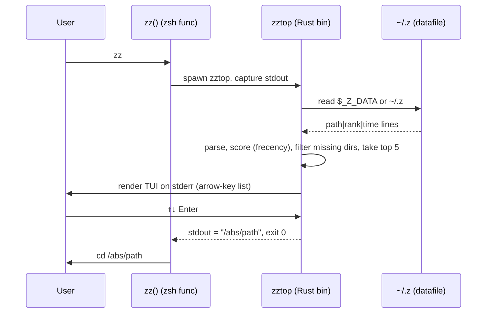

# feat: zztop — arrow-key picker for zsh-z top paths

## Summary

Build `zztop`, a Rust CLI that reads `zsh-z`'s frecency datafile, renders the top 5 paths in an arrow-key TUI, and prints the chosen path on Enter. A 3-line `zz()` zsh function captures stdout and `cd`s the parent shell. Augments `z`; does not replace or modify it.

---

## Problem Frame

`z <pattern>` works well when the user remembers a fragment of where they want to go. It doesn't help when the user wants to *browse* their top recent/frequent directories and pick visually. The brainstorm settled on a small companion command: invoke `zz`, see five paths, arrow-key + Enter to jump. The data already exists in `~/.z` — we just need to surface it differently.

(see origin: `docs/brainstorms/2026-06-03-zztop-requirements.md`)

---

## Requirements

Carried from origin:

- **R1.** Read `zsh-z`'s datafile (`$_Z_DATA` if set, else `~/.z`); never write to it.
- **R2.** Rank by `zsh-z`'s frecency formula (recency × frequency).
- **R3.** Display top 5 paths in an arrow-key TUI; no fuzzy filter.
- **R4.** ↑/↓ moves cursor; Enter selects; Esc / Ctrl-C cancels.
- **R5.** On Enter: print the absolute path to stdout and exit 0.
- **R6.** On cancel or no data: exit non-zero with no stdout output.
- **R7.** Substitute `~` for `$HOME` when displaying paths.
- **R8.** Skip non-existent paths silently and continue down the list.
- **R9.** Ship a `zz()` zsh wrapper snippet in the README.
- **R10.** Friendly stderr message when datafile is missing/empty.

Success criteria from origin:
- Renders in under ~50ms on a warm cache.
- Single static-ish binary on macOS.

---

## Key Technical Decisions

### KTD1. TUI: `dialoguer::Select`

Use the `dialoguer` crate's `Select` prompt for the arrow-key picker.

**Why:** `dialoguer::Select` is purpose-built for "show a list, pick one with arrows" — it handles ↑↓ navigation, Enter, and Esc correctly out of the box, renders cleanly to stderr (leaving stdout free for the chosen path), and clears its UI on exit. `ratatui` is overkill for 5 lines and a single keystroke. Hand-rolling on `crossterm` would re-implement what `dialoguer` already does well, for no benefit at this scope.

**Alternatives considered:**
- `inquire::Select` — equally viable; `dialoguer` chosen for slightly smaller dep tree and longer track record. Either works; not worth a second decision pass.
- `ratatui` — too heavy for one-screen, single-action UI.
- `crossterm` only — more code, same result.

### KTD2. Datafile parsing: direct read, no shell-out

Read `$_Z_DATA` or `~/.z` directly and parse `path|rank|time` lines.

**Why:** The brainstorm chose this over shelling out to `z -l`. Direct read is faster, has no dependency on `zsh-z` being on `PATH` at runtime (it's a zsh function, not a binary, so a Rust child process can't call it anyway), and the format is stable. Risk: if `zsh-z` ever changes its file format, we update the parser — but that hasn't happened in years.

### KTD3. Frecency formula: port `zsh-z`'s exact thresholds

Use `zsh-z`'s frecency formula verbatim:

- If a directory was visited in the last hour: `rank * 4`
- Last day: `rank * 2`
- Last week: `rank * 0.5`
- Otherwise: `rank * 0.25`

**Why:** Approximating ranking would produce a list that doesn't match what `z -l` shows the user, defeating the "top paths" promise. Porting the exact formula is ~5 lines of code and keeps the mental model coherent across `z` and `zz`.

### KTD4. Shell integration: README snippet only (no `init` subcommand)

Ship the `zz()` zsh function as a copy-paste README snippet for v1. No `zztop init zsh` subcommand.

**Why:** The wrapper is 3 lines. A subcommand to print 3 lines is more code, more docs, more surface area, with no current benefit. If we later add bash/fish support or per-shell variations, an `init` subcommand becomes worth it — defer until then.

### KTD5. Stdout/stderr separation

- Chosen path → **stdout** (only on success).
- TUI rendering, prompts, error messages → **stderr**.
- Exit 0 on selection; non-zero on cancel, missing data, or any error.

**Why:** The wrapper does `dir="$(zztop)"`. If anything other than the path leaks to stdout, `cd` breaks. `dialoguer` writes to stderr by default — we just need to not print anything ourselves to stdout except the final path.

### KTD6. Path display vs. emitted path

Display paths with `~` substitution; emit the **absolute, expanded** path on Enter.

**Why:** Display is for humans; the wrapper's `cd "$dir"` needs an unambiguous path. Tilde-substituting only on the visible string keeps both clean.

---

## High-Level Technical Design

### Process & data flow



Cancel path: user presses Esc → `dialoguer` returns no selection → binary exits non-zero with empty stdout → wrapper's `&& cd ...` short-circuits and the shell stays put.

### Module shape

```text
src/
  main.rs        // arg parsing (none for v1), wiring, exit codes
  datafile.rs    // resolve path, read lines, parse Entry { path, rank, time }
  rank.rs        // frecency formula → score; top-N selection
  display.rs     // ~ substitution; render via dialoguer::Select
```

Pure functions in `datafile.rs` and `rank.rs` are unit-testable without a TTY. `display.rs` is the only TUI-coupled module.

---

## Output Structure

```text
zztop/
├── Cargo.toml
├── Cargo.lock
├── README.md
├── .gitignore
├── src/
│   ├── main.rs
│   ├── datafile.rs
│   ├── rank.rs
│   └── display.rs
└── tests/
    └── integration.rs
```

This is a scope declaration — the implementer may collapse modules if any turns out trivially small.

---

## Implementation Units

### U1. Cargo scaffold and project skeleton

**Goal:** Initialize the Rust project with the agreed module layout and dependencies.

**Requirements advanced:** none directly (foundational).

**Dependencies:** none.

**Files:**
- `Cargo.toml`
- `.gitignore`
- `src/main.rs` (stub: `fn main() {}` or prints "todo")
- `src/datafile.rs` (empty module)
- `src/rank.rs` (empty module)
- `src/display.rs` (empty module)

**Approach:**
- `cargo init --bin zztop` (or equivalent manual setup).
- Add dependencies to `Cargo.toml`:
  - `dialoguer` (latest 0.x)
  - `dirs` (for `$HOME` resolution; small, well-maintained)
- Set `edition = "2021"`, package name `zztop`, binary name `zztop`.
- `.gitignore` includes `/target`.

**Patterns to follow:** Standard Rust binary crate layout. No special conventions — this is greenfield.

**Test scenarios:** none — pure scaffolding.
*Test expectation: none -- pure scaffolding, no behavior.*

**Verification:** `cargo check` succeeds; `cargo run` produces no error.

---

### U2. Datafile resolution and parsing

**Goal:** Read and parse `zsh-z`'s datafile into a structured form.

**Requirements advanced:** R1, R10.

**Dependencies:** U1.

**Files:**
- `src/datafile.rs` (implementation)
- `src/datafile.rs` test module (`#[cfg(test)] mod tests`)

**Approach:**
- Public type: `struct Entry { path: PathBuf, rank: f64, time: u64 }`.
- Public fn: `fn load() -> Result<Vec<Entry>, LoadError>`.
- Resolution order: env var `_Z_DATA` if set and non-empty; else `$HOME/.z` via `dirs::home_dir()`.
- Read entire file (these files are small — typically <100KB) with `std::fs::read_to_string`.
- Parse each line as `path|rank|time`, splitting on `|`. Lines that don't parse cleanly are skipped (don't crash the whole tool because of one bad line).
- `LoadError` variants: `MissingHome`, `FileNotFound`, `Empty`, `Io(std::io::Error)`.

**Patterns to follow:** Standard `Result`-returning constructor; `thiserror` is fine if useful, but not required for this scope — a hand-rolled enum is enough.

**Test scenarios:**
- Parses a typical `path|rank|time\n` line into the expected `Entry`.
- Parses a multi-line fixture with mixed valid/invalid lines, returning only the valid entries.
- Returns `Empty` for a zero-byte file.
- Returns `FileNotFound` when the resolved path doesn't exist.
- Honors `_Z_DATA` env var when set (use a tempfile and set the var for the test).
- Handles paths containing `|` characters in the path component — split-once on the first `|`, not all of them. (zsh-z writes the path first, then `|rank|time`; pipe in path is rare but possible.)

Write fixtures inline as string literals; use `tempfile` crate (dev-dependency) for filesystem tests.

**Verification:** `cargo test datafile::` passes.

---

### U3. Frecency ranking and top-N selection

**Goal:** Score entries by `zsh-z`'s frecency formula and select the top 5 existing directories.

**Requirements advanced:** R2, R8.

**Dependencies:** U2.

**Files:**
- `src/rank.rs` (implementation)
- `src/rank.rs` test module

**Approach:**
- Public fn: `fn top_n(entries: &[Entry], now: u64, n: usize) -> Vec<&Entry>`.
- For each entry, compute `frecency(rank, age_seconds)`:
  - `age < 3600` → `rank * 4.0`
  - `age < 86400` → `rank * 2.0`
  - `age < 604800` → `rank * 0.5`
  - else → `rank * 0.25`
- Pass `now` as a parameter (don't call `SystemTime::now()` inside the ranker) — makes the function pure and trivially testable.
- Sort entries by computed score descending.
- Filter: skip entries whose path doesn't exist (`Path::exists()`). Apply this filter *after* sorting so we walk the ranked list in order and stop once we have N.
- Return up to `n` references; may return fewer if the filtered pool is small.

**Patterns to follow:** Pure function with injected clock. Avoid global state.

**Test scenarios:**
- Score thresholds: an entry visited 30 min ago with rank 1.0 scores higher than one visited 2 days ago with rank 4.0 (verifies the 4× boost).
- Tied scores break in stable order (whatever Rust's stable sort gives).
- `top_n` returns at most N entries.
- `top_n` returns fewer than N when the input has fewer entries.
- Non-existent paths are filtered out (use `tempfile` to create real dirs and reference both real and fake paths).
- Filter happens after sort: a high-ranked non-existent path doesn't crowd out a real lower-ranked one.

**Verification:** `cargo test rank::` passes.

---

### U4. TUI rendering and selection

**Goal:** Show the top paths in an arrow-key picker; return the chosen absolute path or signal cancel.

**Requirements advanced:** R3, R4, R5, R6, R7.

**Dependencies:** U3.

**Files:**
- `src/display.rs` (implementation)

**Approach:**
- Public fn: `fn pick(entries: &[Entry], home: &Path) -> Result<Option<PathBuf>, DisplayError>`.
  - `Ok(Some(path))` — user selected; return absolute path.
  - `Ok(None)` — user cancelled (Esc / Ctrl-C).
  - `Err(_)` — TTY/IO failure.
- Build display strings: replace a leading `home` prefix with `~`. Number prefix (`1  `, `2  `, …) is fine — improves scannability and matches the brainstorm mockup.
- Use `dialoguer::Select::new()` with the labeled items, `.default(0)`, `.interact_opt()` (returns `Ok(None)` on Esc).
- `dialoguer` writes to stderr by default — don't override.

**Patterns to follow:** None — first TUI in the codebase. Match `dialoguer`'s idiomatic usage from its docs.

**Test scenarios:**
- Path display: `~/Workspace/foo` is shown when `home = /Users/x` and path = `/Users/x/Workspace/foo`.
- Path display: paths *not* under home are shown verbatim (no `~` substitution).
- Path display: home itself displays as `~`.

The interactive `pick` call itself is not unit-tested (requires a TTY); covered by manual verification and the integration test in U6.

**Verification:** `cargo test display::` passes for the path-display helpers.

---

### U5. Wire `main` and finalize stdout/exit-code contract

**Goal:** Compose the modules; ensure exit codes and stdout match the wrapper's expectations.

**Requirements advanced:** R5, R6, R10.

**Dependencies:** U2, U3, U4.

**Files:**
- `src/main.rs`

**Approach:**
- Resolve `now` (Unix seconds) and `home` once at the top.
- Call `datafile::load()`. On error:
  - `Empty` / `FileNotFound` → eprintln "no zsh-z data found" → exit 1.
  - `MissingHome` → eprintln "could not resolve $HOME" → exit 2.
  - `Io(e)` → eprintln "failed to read zsh-z data: {e}" → exit 2.
- Call `rank::top_n(&entries, now, 5)`. If empty after filtering → eprintln "no existing paths in zsh-z data" → exit 1.
- Call `display::pick(&top, &home)`:
  - `Ok(Some(path))` → `println!("{}", path.display())` → exit 0.
  - `Ok(None)` → exit 1 (cancelled).
  - `Err(_)` → eprintln, exit 2.
- v1 takes no CLI flags. (`--help` / `--version` come for free if we ever add `clap`; not needed yet.)

**Patterns to follow:** Use `std::process::exit(code)` for non-zero exits to keep the contract explicit.

**Test scenarios:** None at the unit level — covered by U6's integration test.
*Test expectation: none -- main is wiring; behavior is covered by U6.*

**Verification:** `cargo build --release` produces a binary; manual smoke-test against a real `~/.z` shows the picker and selection works end-to-end.

---

### U6. Integration test for the binary contract

**Goal:** Verify the binary's stdout/exit-code contract end-to-end without a TTY.

**Requirements advanced:** R5, R6, R10.

**Dependencies:** U5.

**Files:**
- `tests/integration.rs`
- Add `assert_cmd` and `tempfile` as dev-dependencies in `Cargo.toml`.

**Approach:**
Use `assert_cmd` (the canonical Rust CLI integration testing crate) to run the compiled binary as a subprocess against fixture datafiles.

**Test scenarios:**
- **Empty datafile:** `_Z_DATA` points at an empty file → exit code is non-zero, stdout is empty, stderr contains "no zsh-z data".
- **Missing datafile:** `_Z_DATA` points at a non-existent path → exit code is non-zero, stdout is empty.
- **All paths missing on disk:** datafile lists 3 paths, none exist → exit code is non-zero, stdout is empty, stderr mentions no existing paths.
- **Datafile with valid paths but no TTY:** running the binary with stdin/stdout piped → `dialoguer` should fail gracefully or produce a non-zero exit; assert exit is non-zero and stdout is empty (we don't want to accidentally emit a path when there's no TTY to interact with).

The "happy path" of "user presses Enter → correct path on stdout" is not automatable without a pty — verify manually.

**Verification:** `cargo test --test integration` passes.

---

### U7. README with wrapper snippet and install instructions

**Goal:** Document install, the `zz()` wrapper, and the `_Z_DATA` env var.

**Requirements advanced:** R9.

**Dependencies:** U5 (binary builds and behaves correctly).

**Files:**
- `README.md`

**Approach:**
README sections (concise):
1. **What it is** — one paragraph: companion to `zsh-z`, top-5 arrow-key picker, prints chosen path.
2. **Install** — `cargo install --path .` (and a placeholder note that `cargo install zztop` will work once published, if ever).
3. **Setup** — copy this into `~/.zshrc`:
   ```sh
   zz() {
     local dir
     dir="$(zztop)" && cd "$dir"
   }
   ```
4. **Usage** — run `zz`, arrow keys, Enter.
5. **How it works** — reads `$_Z_DATA` or `~/.z`; never writes.
6. **Requires** — a working `zsh-z` installation (link to its repo).

**Test scenarios:** none — documentation.
*Test expectation: none -- documentation only.*

**Verification:** Read the README; copy the snippet into a real `.zshrc`; confirm `zz` works.

---

## Scope Boundaries

### In scope
- Top 5, frecency-ranked, arrow-key picker.
- macOS + zsh.
- README snippet for shell integration.

### Deferred to Follow-Up Work
- Publishing to crates.io / homebrew / a release pipeline.
- CI setup (GitHub Actions for `cargo test` / `cargo build`).
- A `zztop init zsh` subcommand (deferred per KTD4).

### Deferred for later (from origin)
- Bash / fish wrapper variants.
- Fuzzy filter mode (`--filter`, `zz <pattern>`).
- Dynamic list size based on terminal height.
- A `--print` mode that lists paths without the TUI.

### Outside this product's identity (from origin)
- Replacing or modifying `zsh-z`. `zztop` reads only.
- Building its own frecency tracking. We borrow `zsh-z`'s data.
- Configurability. Hardcoded defaults; change in source if needed.

---

## Risks & Mitigations

| Risk | Likelihood | Impact | Mitigation |
|---|---|---|---|
| `zsh-z` datafile format changes upstream | Low | High (parser breaks) | Format hasn't changed in years. If it does, parser update is a few lines. Detect via integration tests against real fixtures. |
| `dialoguer` doesn't render well in some terminals | Low | Medium | `dialoguer` is widely used and battle-tested. If a specific terminal is broken, fall back to numbered list as a future option. |
| Binary slow on cold cache (>50ms target from origin) | Low | Low | File is small, parser is linear, sort is on ~100s of items. Should be well under target. Measure with `time zztop </dev/null` if concerned. |
| User has no `~/.z` yet (fresh `zsh-z` install) | Medium | Low | Friendly stderr message; non-zero exit. The wrapper's `&&` keeps the shell put. |
| Path contains `|` | Low | Low | Use `split_once('|')` repeatedly from the right (time → rank → path) instead of `split('|')` collecting all. Covered in U2 tests. |

---

## Verification

A future implementer can consider this done when:

- `cargo test` passes (datafile parser, ranker, display helpers, integration tests).
- `cargo build --release` produces `target/release/zztop`.
- Adding the README's `zz()` snippet to `.zshrc` and running `zz` shows 5 paths from real `~/.z` data, arrow keys move, Enter `cd`s correctly, Esc cancels with no shell change.
- Edge cases manually verified: missing datafile (friendly error, no `cd`); all paths stale (friendly error, no `cd`).

---

## Open Questions Deferred to Implementation

- Exact error message wording (small enough to settle in code review).
- Whether to add `--version` / `--help` (not required by R-set; trivially added later via `clap` if wanted).
- Whether to surface datafile-parse warnings (currently silent skip — fine for v1).

🤖 Generated by Claude Code
